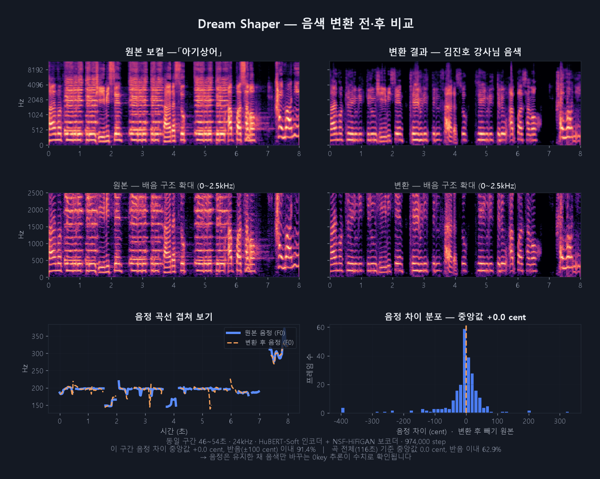
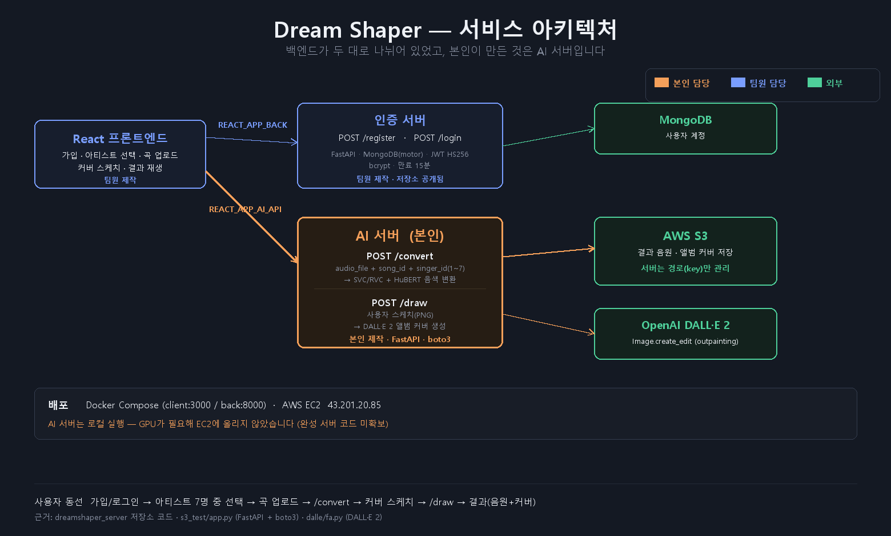
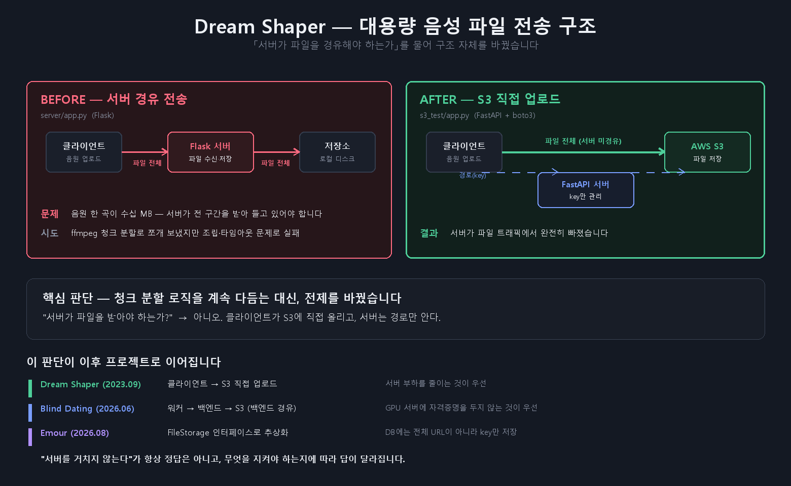
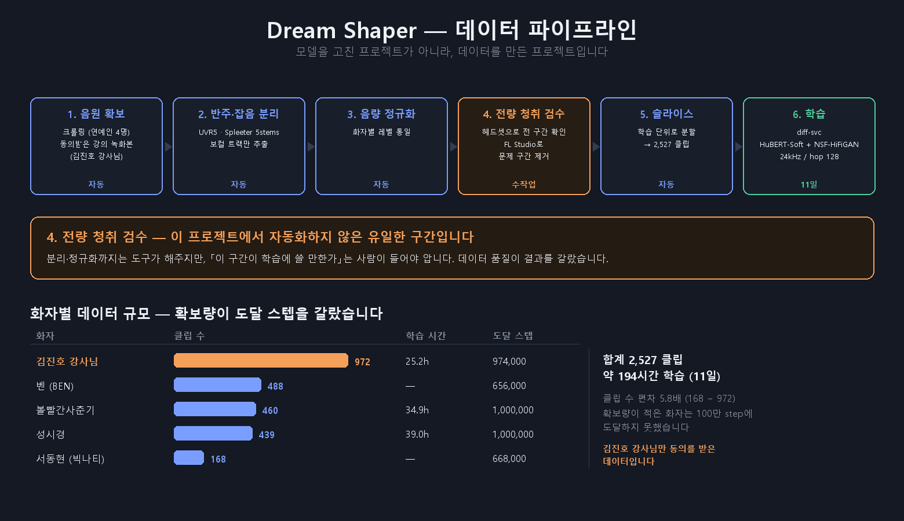
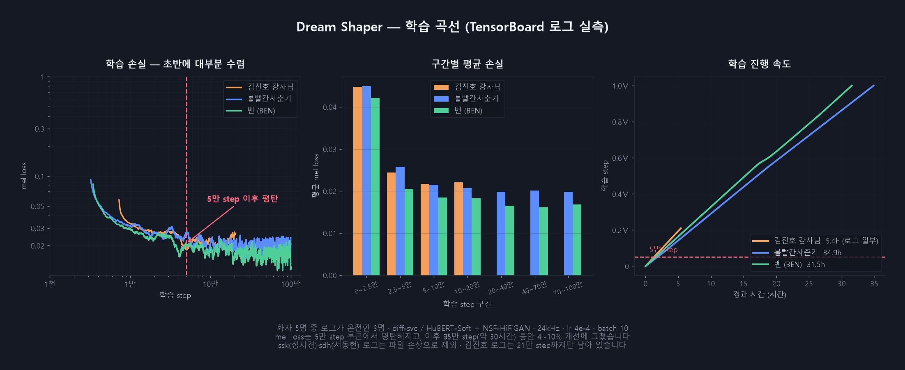
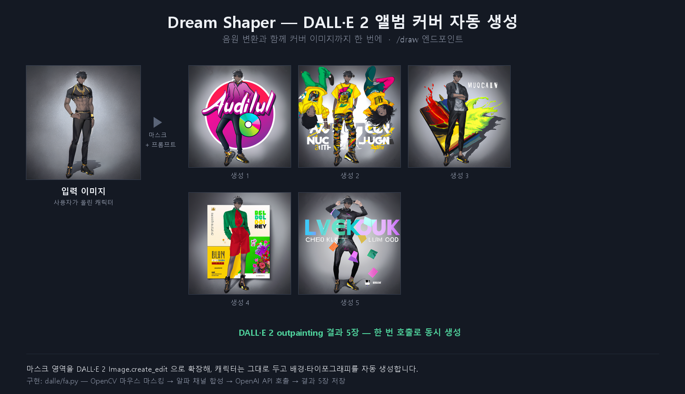
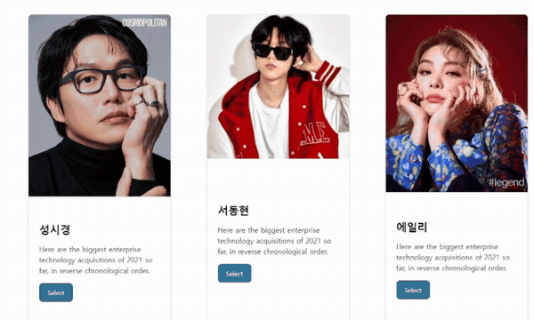

# Dream Shaper

**목소리를 학습해 원하는 음색으로 노래를 부르게 하는 AI 음성 변환 서비스.**
앨범 커버까지 자동 생성해 음원과 커버를 한 번에 얻습니다.

<p align="center">
  
  
  
  
</p>

| 화자 모델 | 슬라이스 클립 | 학습 시간 | 음정 차이 중앙값 |
|:---:|:---:|:---:|:---:|
| **5명** | **2,527개** | **약 194시간** | **+0.0 cent** |

<p align="center">
  <br>
  <em>같은 노래, 다른 음색 — 음정은 유지되고 배음 구조만 바뀝니다 (화자명은 익명 처리)</em>
</p>

📖 **[포트폴리오에서 보기](https://chlgks2.github.io/p/dream-shaper.html)** · 발주처 한국전파진흥협회

---

## 목차

| | |
|---|---|
| [담당 범위](#담당-범위) · [파일 전송 구조를 바꿨습니다](#파일-전송-구조를-바꿨습니다) | 설계 판단 |
| [데이터가 결과를 갈랐습니다](#데이터가-결과를-갈랐습니다) · [학습 곡선에서 확인한 것](#학습-곡선에서-확인한-것) | 학습 |
| [음색 변환이 되는지 수치로 확인했습니다](#음색-변환이-되는지-수치로-확인했습니다) · [앨범 커버 자동 생성](#앨범-커버-자동-생성) | 검증 |
| [결과물](#결과물) · [저장소 구성](#저장소-구성) · [이용 및 권리 안내](#-이용-및-권리-안내) | 자료 |

## 이 저장소에 대하여

**2023년 9월 프로젝트를 2026년에 아카이브로 정리한 것입니다.**

- **결과물 일부를 함께 공개합니다** — 시연영상 · 대표 변환 음원 3곡. 비영리 학습 목적이며, 권리자 요청 시 즉시 내립니다 ([NOTICE](#-이용-및-권리-안내))
- **모델 가중치와 학습 데이터는 올리지 않았습니다**
- 코드는 **본인이 작성한 것만** 담았고, diff-svc 본체는 [원본 저장소](https://github.com/prophesier/diff-svc)를 참조하십시오

---

## 담당 범위

원래 배정은 **AI 모델 담당**이었습니다. 프로젝트 중반 **백엔드 3명이 전원 이탈·미참여**하면서 서버까지 맡게 됐습니다.

| 담당 | 내용 |
|---|---|
| AI 모델 | 화자 **5명** 학습 · 데이터 확보·정제 · 학습 운영 |
| **AI 서버** | **FastAPI** 독학해 구축 · **boto3** S3 연동 · **DALL·E 2** 앨범 커버 |
| 구조 판단 | 서버 경유 전송 실패 → **S3 직접 업로드로 전환** |

<p align="center">
  
</p>

**백엔드가 두 대로 나뉘어 있었습니다.** 인증 서버와 프론트엔드는 팀원이 만들었고, 본인이 만든 것은 `/convert`·`/draw` **AI 서버**입니다.

---

## 파일 전송 구조를 바꿨습니다

음원 한 곡이 수십 MB인데 서버가 전 구간을 받아 들고 있어야 했습니다. ffmpeg 청크 분할로 쪼개 봤지만 조립·타임아웃 문제로 실패했습니다.

<p align="center">
  
</p>

> **청크 분할 로직을 계속 다듬는 대신 전제를 바꿨습니다.**
> *"서버가 파일을 받아야 하는가?" → 아니오. 클라이언트가 S3에 직접 올리고, 서버는 경로(key)만 안다.*

이 판단이 이후 프로젝트로 이어집니다. 다만 **답은 매번 달랐습니다** — Blind Dating에서는 반대로 백엔드를 경유하게 했습니다. GPU 서버에 자격증명을 두지 않는 것이 더 중요했기 때문입니다.

**"서버를 거치지 않는다"가 항상 정답은 아니고, 무엇을 지켜야 하는지에 따라 답이 달라집니다.**

---

## 데이터가 결과를 갈랐습니다

**모델 아키텍처는 수정하지 않았습니다.** HuBERT-Soft 인코더와 NSF-HiFiGAN 보코더는 공개 사전학습 자산을 받아 썼습니다.
**기여는 데이터 확보·정제와 학습 운영입니다.**

<p align="center">
  
</p>

| | |
|---|---|
| 학습 화자 | **5명** |
| 슬라이스 클립 | **2,527개** (화자당 168 ~ 972) |
| 학습 시간 | 합계 **약 194시간** (2023.09.12 ~ 09.22) |
| 도달 스텝 | 3개 모델이 **1,000,000 step** |

**4번 「전량 청취 검수」가 자동화하지 않은 유일한 구간입니다.** 분리·정규화는 도구가 하지만 "이 구간이 학습에 쓸 만한가"는 사람이 들어야 압니다.

---

## 학습 곡선에서 확인한 것

<p align="center">
  
</p>

TensorBoard 로그를 다시 파싱해보니 **mel loss가 5만 step 부근에서 이미 평탄**했습니다.
이후 **95만 step(약 30시간)을 더 돌렸지만 손실은 4~10% 개선**에 그쳤습니다.

> 당시엔 지표를 보지 않고 최대한 오래 돌리는 게 낫다고 생각했습니다.
> 지금이라면 **검증 손실을 보고 조기 종료를 걸었을 것**입니다.
>
> 다만 mel loss가 음질의 전부는 아닙니다. 지각 품질은 손실이 평탄해진 뒤에도 좋아질 수 있어, **"손실 기준으로는 평탄했다"** 까지만 말할 수 있습니다.

---

## 음색 변환이 되는지 수치로 확인했습니다

<p align="center">
  
</p>

| 측정 | 값 |
|---|---|
| 음정 차이 **중앙값** | **+0.0 cent** |
| 반음(±100 cent) 이내 — 해당 8초 구간 | 91.4% |
| 반음 이내 — 곡 전체 116초 | 62.9% |
| 원본↔변환 에너지 포락선 상관 | 0.781 |

**중앙값이 정확히 0 cent** 라는 것이 `0key` 추론(키 이동 없음) 설정과 맞아떨어집니다.
**음정은 유지하고 음색만 바꾼다**는 SVC의 원리를 말이 아니라 수치로 보여줍니다.

> 곡 전체로는 62.9%입니다. 프레임 단위로는 편차가 있어 "완벽하게 일치한다"고는 말하지 않습니다.

---

## 앨범 커버 자동 생성

<p align="center">
  
</p>

입력 이미지 1장에 마스크를 씌워 DALL·E 2 outpainting으로 **앨범 커버 5장을 한 번에** 생성합니다.
구현은 [`src/dalle_cover.py`](src/dalle_cover.py) 입니다.

---

## 결과물

### 서비스 동작

<p align="center">
  <br>
  <em>아티스트 선택 → 샘플 청취 → 음원 업로드 → 변환</em>
</p>

▶ **전체 시연 영상** — [`assets/demo/service-demo.mp4`](assets/demo/service-demo.mp4) (1분 10초)
가입 → 아티스트 선택 → 곡 업로드 → 변환 → 앨범 커버 생성 → 결과 재생까지 전 과정.

### 변환 음원

> GitHub는 README에서 오디오를 재생하지 못합니다. 파일을 눌러 내려받아 들으십시오.

| 음원 | 내용 | 모델 학습 | 길이 |
|---|---|---|---|
| [`summer-cover.mp3`](assets/audio/summer-cover.mp3) | Paul Blanco 「Summer」 → 화자 D 음색 | ✅ **본인 학습** | 3:20 |
| [`hypeboy-cover.mp3`](assets/audio/hypeboy-cover.mp3) | NewJeans 「Hype Boy」 → 화자 F 음색 | 팀원 학습 | 2:48 |
| [`lecturer-voice-narration.mp3`](assets/audio/lecturer-voice-narration.mp3) | **발표 내레이션** — 아래 참조 | ✅ **본인 학습** | 0:50 |

> **모델을 누가 학습했는지 구분해 적었습니다.**
> `hypeboy-cover` 는 **팀원이 학습한 모델**을 받아 **본인이 추론과 믹싱을 한 결과물**입니다 — 원곡 보컬 분리, 추론 파라미터 설정, 반주 합성이 본인 작업입니다.
> 나머지 두 곡은 **데이터 확보부터 학습까지 본인이 한 모델**로 만들었습니다.

▶ **팀 공동 데모** — [`assets/demo/pinkfong-cover.mp4`](assets/demo/pinkfong-cover.mp4) (49초)
「아기상어」 한 곡을 여러 화자의 음색으로 변환한 영상입니다. **팀 전체 결과물**이며, 본인이 학습한 모델은 그중 일부입니다.

### ⭐ 강사님 목소리로 발표 내레이션을 만들었습니다

`lecturer-voice-narration.mp3` 는 데모용 샘플이 아닙니다.

| 과정 | |
|---|---|
| 1 | 아카데미 **강사님께 직접 허락**을 받고 과거 수업 녹화 영상 **약 2시간** 확보 |
| 2 | 영상에서 음성만 추출 → 전처리·정제 → **972 클립** |
| 3 | 그 데이터로 음색 모델 학습 (25.2시간 · 974,000 step) |
| 4 | **본인이 미리 녹음한 발표 대본**을 그 모델로 변환 |
| 5 | 발표 중 ffmpeg 파트에서 *"이 부분은 어려우니 전문가가 설명해주실 것"* 이라고 넘긴 뒤 재생 |

**데이터 확보부터 발표 연출까지 하나의 목적으로 이어진 결과물**입니다.
이 프로젝트에서 **유일하게 당사자 동의를 받아 만든 모델**이기도 합니다.

---

## 저장소 구성

```
dreamshaper/
├─ assets/
│  ├─ (차트 6장)               시각자료
│  ├─ audio/                   변환 음원 3곡
│  └─ demo/                    시연영상 · 팀 데모 영상
├─ src/
│  ├─ s3_upload_api.py         ⭐ FastAPI + boto3 S3 업로드 (본인 코드)
│  ├─ dalle_cover.py           ⭐ DALL·E 2 앨범 커버 생성 (본인 코드)
│  └─ legacy_flask_upload.py   서버 경유 전송 — 폐기된 초기 버전
├─ config/training_config.yaml diff-svc 학습 설정 (5개 모델 공통)
└─ docs/
   ├─ TRAINING.md              학습 설정·데이터 파이프라인 실측값
   └─ ARCHITECTURE.md          서버 구조와 담당 범위
```

## 기술 스택

| 구분 | 기술 |
|---|---|
| AI/ML | diff-svc · **HuBERT-Soft** 인코더 · **NSF-HiFiGAN** 보코더 · RVC · DALL·E 2 |
| 백엔드 | Python · **FastAPI** · **boto3** |
| 클라우드 | AWS S3 |
| 데이터 | UVR5 · Spleeter · FL Studio · ffmpeg |
| 프론트엔드 | React *(팀원 담당)* |

## 학습 설정

| 항목 | 값 |
|---|---|
| 샘플레이트 / hop | 24kHz / **128** (기본 512에서 낮춤) |
| Diffusion | `timesteps` 1000 · WaveNet **20층 × 256채널** |
| f0 | 50 ~ 1100Hz · `parselmouth` |
| 학습률 / 배치 | 4e-4 / 10 · AMP |
| 추론 | **0key**(키 이동 없음) · **PNDM 20배 가속** · FLAC 출력 |

`hop_size`를 낮춰 시간 해상도를 올리고 `residual_channels`를 줄여 모델 폭을 낮춘 조합입니다. 같은 VRAM에서 가창의 음정 변화를 더 촘촘히 잡으려는 설정입니다.

---

## 📄 이용 및 권리 안내

이 저장소는 **비영리 학습·포트폴리오 목적**입니다. 상업적 이용을 허용하지 않습니다.

| 공개한 것 | 비고 |
|---|---|
| 변환 음원 3곡 · 시연영상 · 팀 데모 영상 | 학습 성과를 보이기 위한 최소 선별 |
| 분석 지표 · 다이어그램 · 본인 작성 코드 | |

| 공개하지 않은 것 | 이유 |
|---|---|
| **학습된 화자 모델 (체크포인트)** | 받는 사람이 그 목소리로 무엇이든 만들 수 있습니다 |
| **크롤링한 학습 데이터** | 원본 음원 저작권 |
| diff-svc 본체 코드 | 본인 작성분이 아닙니다 |

### 권리자께

수록된 음원은 원곡의 저작권과 실연자의 권리, 그리고 재현된 음색의 인격적 권리가 관련됩니다.
**게시 중단을 원하시면 저장소 Issue 또는 프로필 연락처로 알려주십시오. 확인 즉시 삭제하겠습니다.**

> 화자 중 **강사님 모델만 당사자 동의를 받아 데이터를 확보**했고, 나머지는 크롤링 데이터입니다.
> 차트에서는 화자를 `A~F` 로 표기합니다.

## 관련 링크

- 시연영상 — https://drive.google.com/file/d/1eS3johbV3ezYvJUbrOLBnZYBJbKBzB3a/view
- diff-svc 원본 — https://github.com/prophesier/diff-svc
